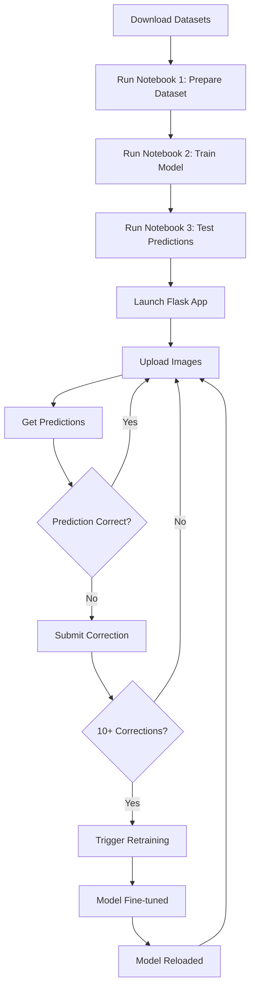

# Food Multi-Label Classification Pipeline

<p align="center">
  
</p>

<p align="center">
  <strong>Multilabel Dataset Builder + MobileNetV2 Training + MLflow Tracking + Flask Web UI + Incremental Retraining</strong>
</p>

<p align="center">
  <b>Authors:</b> Erika Contreras, Alexander Chuquipoma<br>
  <b>Institution:</b> Universidad Politecnica Salesiana
</p>

---

## Overview

This repository implements a **complete end-to-end pipeline** for multilabel food image classification with **incremental retraining capabilities**:

| Step | Description |
|------|-------------|
| 1 | Generate a **real multilabel dataset** from Food11 + FoodOrNot |
| 2 | Train a deep learning classifier using **MobileNetV2 (ImageNet)** |
| 3 | Track experiments and metrics with **MLflow** |
| 4 | Run predictions on images (single image inference) |
| 5 | Deploy a **Flask web interface** for visual analysis |
| 6 | **Collect user corrections** and retrain incrementally |

---

## Datasets Used

| Dataset | Source | Purpose |
|---------|--------|---------|
| **Food-11** | [Kaggle](https://www.kaggle.com/datasets/trolukovich/food11-image-dataset) | Food categories (Dairy, Rice, Vegetables) |
| **FoodOrNot** | [Kaggle](https://www.kaggle.com/datasets/sciencelabwork/food-or-not-dataset) | Non-food negative samples |

---

## Target Classes (Multilabel)

The model predicts **independent probabilities** for each class:

| Class | Description |
|-------|-------------|
| `lacteos` | Dairy products |
| `arroz` | Rice |
| `frutas/verduras` | Fruits and vegetables |

**Example multilabel vectors:**

| Vector | Meaning |
|--------|---------|
| `[1, 0, 0]` | Dairy only |
| `[0, 1, 1]` | Rice + Fruits/Vegetables |
| `[1, 1, 1]` | All classes |
| `[0, 0, 0]` | None / Non-food |

---

## Repository Structure

```
Food-Multi-Label-Classification-Pipeline/
│
├── raw/                                    # Raw datasets (manual download)
│   ├── food11/
│   │   ├── training/
│   │   │   ├── Dairy product/
│   │   │   ├── Rice/
│   │   │   └── Vegetable-Fruit/
│   │   ├── validation/
│   │   └── evaluation/
│   └── foodornot/
│       ├── train/negative_non_food/
│       └── test/negative_non_food/
│
├── dataset/                                # Generated dataset (auto)
│   ├── images/
│   └── labels.csv
│
├── notebooks/                              # Jupyter Notebooks
│   ├── 1_prepare_dataset_multilabel_real.ipynb
│   ├── 2_train_multilabel (1).ipynb
│   └── predict_image_multilabel.ipynb
│
├── outputs/                                # Trained model
│   └── model.keras
│
├── corrections/                            # Incremental retraining system
│   ├── pending.csv                         # User corrections awaiting retraining
│   ├── history/                            # Archived corrections from past retrains
│   └── retraining_status.txt               # Current retraining status
│
├── mlruns/                                 # MLflow experiment logs (auto)
│
├── flask_app/                              # Web application
│   ├── app.py                              # Main Flask API
│   ├── retrain_service.py                  # Incremental retraining service
│   ├── templates/
│   │   └── index.html
│   └── static/
│       ├── style.css
│       └── uploads/
│
├── sync_labels.py                          # Sync new images to labels.csv
└── test_model.py                           # Quick model testing script
```

---

## Requirements

```bash
pip install tensorflow pandas numpy pillow scikit-learn mlflow flask
```

| Package | Purpose |
|---------|---------|
| `tensorflow` | Deep learning framework (MobileNetV2, tf.data) |
| `pandas` | CSV handling and data manipulation |
| `numpy` | Numerical operations |
| `pillow` | Image loading and collage generation |
| `scikit-learn` | Train/validation split |
| `mlflow` | Experiment tracking |
| `flask` | Web interface for predictions |

---

## Pipeline Details

### Step 1: Dataset Preparation

**Notebook:** `notebooks/1_prepare_dataset_multilabel_real.ipynb`

Generates a multilabel dataset by creating **collage images** that combine multiple food categories.

**Configuration:**

| Parameter | Value | Description |
|-----------|-------|-------------|
| `N_TRAIN` | 3,000 | Collages for training |
| `N_VAL` | 600 | Collages for validation |
| `N_TEST` | 600 | Collages for testing |
| `P_INCLUDE` | 0.60 | Probability each class appears |
| `MAX_NONFOOD_TRAIN` | 1,200 | Non-food samples for training |
| `IMG_SIZE` | 224×224 | Image dimensions |

**Output Statistics:**

| Metric | Value |
|--------|-------|
| Total images | 5,800 |
| `lacteos` positives | ~2,627 |
| `arroz` positives | ~2,565 |
| `frutas/verduras` positives | ~2,573 |
| Non-food (NONE) | 1,600 |

---

### Step 2: Model Training

**Notebook:** `notebooks/2_train_multilabel (1).ipynb`

Uses **transfer learning** with MobileNetV2 pretrained on ImageNet.

**Architecture:**

```
Input (224×224×3)
       ↓
MobileNetV2 (ImageNet pretrained)
       ↓
GlobalAveragePooling2D
       ↓
Dropout (0.2)
       ↓
Dense (3 units, sigmoid)
       ↓
Output: [P(lacteos), P(arroz), P(frutas/verduras)]
```

**Two-Stage Training Strategy:**

| Stage | Description | Learning Rate | Trainable Params |
|-------|-------------|---------------|------------------|
| `head` | Train classification head only (backbone frozen) | 1e-3 | ~3,843 |
| `finetune` | Unfreeze last 30 layers of backbone | 1e-4 | ~1M+ |

**Training Results:**

| Epoch | Train Acc | Val Acc | Val AUC | Val Loss |
|-------|-----------|---------|---------|----------|
| 1 | 82.47% | 88.85% | 0.9606 | 0.2702 |
| 5 | 94.84% | 94.43% | 0.9877 | 0.1516 |
| 10 | 96.19% | 95.43% | 0.9915 | 0.1236 |

**MLflow Tracking:**

```bash
mlflow ui
# Open http://localhost:5000
```

---

### Step 3: Single Image Prediction

**Notebook:** `notebooks/predict_image_multilabel.ipynb`

**Prediction Pipeline:**

```python
# Load and preprocess
img = tf.io.read_file(path)
img = tf.image.decode_image(img, channels=3)
img = tf.image.resize(img, (224, 224))
img = img / 255.0

# Predict
probs = model.predict(img)

# Apply thresholds
THRESH = 0.50
NONE_IF_MAX_BELOW = 0.45
```

**Decision Logic:**

| Condition | Result |
|-----------|--------|
| Any class ≥ 0.50 | Return all classes above threshold |
| Max probability < 0.45 | "Not found / None" |
| Otherwise | "Uncertain (most probable: X)" |

**Example Output:**

```
📌 Image: test_0000001.jpg

Probabilities:
 - lacteos: 92.94%
 - arroz: 2.33%
 - frutas/verduras: 99.95%

✅ Final Result: lacteos, frutas/verduras
```

---

### Step 4: Flask Web Application

**Location:** `flask_app/`

```bash
cd flask_app
python app.py
# Open http://localhost:5000
```

**Features:**

- **Multi-image upload** via web form (JPG, PNG, WEBP)
- **Real-time predictions** with probability visualization
- **Internationalization** (English/Spanish)
- **Correction submission** for model improvement
- **Automatic retraining** when enough corrections accumulate

**API Endpoints:**

| Endpoint | Method | Description |
|----------|--------|-------------|
| `/` | GET/POST | Main page with image upload and prediction |
| `/correct_labels` | POST | Submit correction for a prediction |
| `/trigger_retrain` | POST | Manually trigger retraining |
| `/retrain_status` | GET | Check retraining status |

---

### Step 5: Incremental Retraining System

**Service:** `flask_app/retrain_service.py`

The system implements a **feedback loop** where user corrections automatically improve the model.

**How It Works:**

1. **User corrects** a wrong prediction via the web UI
2. Correction is saved to `corrections/pending.csv`
3. When **10+ corrections** accumulate, retraining is triggered
4. Model is **fine-tuned** on:
   - Sample of original dataset (200 images)
   - User corrections (repeated 25x for emphasis)
5. Updated model replaces the old one
6. Corrections are archived to `corrections/history/`

**Configuration:**

| Parameter | Value | Description |
|-----------|-------|-------------|
| `MIN_CORRECTIONS` | 10 | Minimum corrections to trigger retraining |
| `SAMPLE_ORIGINAL` | 200 | Images sampled from original dataset |
| `BOOST_FACTOR` | 25 | Repetition factor for corrections |
| `EPOCHS` | 3 | Fine-tuning epochs |
| `LEARNING_RATE` | 1e-5 | Very low LR to avoid catastrophic forgetting |
| `UNFREEZE_LAYERS` | 15 | Number of backbone layers to unfreeze |

**Retraining Strategy:**

- **Conservative fine-tuning**: Only unfreezes last 15 layers (vs 30 in initial training)
- **Low learning rate**: 1e-5 to preserve learned features
- **Balanced dataset**: Combines original samples with boosted corrections
- **Non-blocking**: Runs in background thread

**Status Tracking:**

```bash
# Check retraining status
cat corrections/retraining_status.txt

# Example output:
STATUS:idle
Waiting for corrections... (7/10)
```

---

## Complete Workflow: From Training to Retraining



---

## Key Technical Decisions

| Decision | Rationale |
|----------|-----------|
| **MobileNetV2** | Lightweight, efficient, suitable for mobile/edge deployment |
| **Sigmoid activation** | Independent probability per class (multilabel) |
| **Binary Cross-Entropy** | Standard loss for multilabel classification |
| **Collage generation** | Simulates real-world scenarios with multiple food items |
| **Non-food negatives** | Reduces false positives, improves rejection capability |
| **Sample weighting (NEG_WEIGHT=4.0)** | Penalizes false positives on NONE samples |
| **Two-stage training** | Head-only first, then fine-tune for better convergence |
| **Conservative retraining** | Unfreezes fewer layers (15 vs 30) to avoid forgetting |
| **Correction boosting** | Repeats corrections 25x to emphasize user feedback |
| **Low LR retraining** | 1e-5 vs 1e-4 to preserve learned features |

---

## Real-World Applications

This pipeline can be adapted for various practical use cases:

| Application | Description |
|-------------|-------------|
| **Nutrition Apps** | Automatically identify food types in meal photos for dietary tracking |
| **Smart Refrigerators** | Detect and inventory food items inside refrigerators |
| **Restaurant Automation** | Verify dishes before serving to ensure correct components |
| **Healthcare** | Monitor patient meals for dietary compliance |
| **Food Delivery QA** | Validate order contents through image analysis |

---

## Educational Value

This project demonstrates key concepts in modern deep learning:

| Concept | Implementation |
|---------|----------------|
| **Transfer Learning** | Using pretrained MobileNetV2 as feature extractor |
| **Multilabel Classification** | Sigmoid outputs with binary cross-entropy loss |
| **Data Augmentation** | Collage generation to simulate complex scenarios |
| **Negative Sampling** | Including non-food images to reduce false positives |
| **Experiment Tracking** | MLflow for reproducible ML experiments |
| **Model Deployment** | Flask web application for inference |
| **Two-Stage Training** | Head training + fine-tuning strategy |
| **Incremental Learning** | User feedback loop with conservative retraining |
| **Active Learning** | Collecting corrections on difficult examples |

---

## Technical Achievements

| Metric | Value |
|--------|-------|
| **Validation Accuracy** | 95.43% |
| **Validation AUC** | 0.9915 |
| **Model Size** | ~8.6 MB (MobileNetV2) |
| **Inference Time** | < 100ms (CPU) |
| **Inference Ready** | Yes (Keras .keras format) |
| **Web Deployment** | Flask application included |
| **Incremental Learning** | Automated retraining system |

---

## Future Improvements

- **Expand classes**: Add more food categories
- **Object detection**: Integrate YOLO for localization
- **Model optimization**: Quantization for mobile deployment
- **Database backend**: Replace CSV with proper database
- **Queue system**: Use Celery for async retraining
- **A/B testing**: Compare model versions in production
- **Grad-CAM visualization**: Show what the model is looking at

---

## License

This project is developed as part of academic research at Universidad Politecnica Salesiana.

---

## Authors

- **Erika Contreras**
- **Alexander Chuquipoma**

**Institution:** Universidad Politecnica Salesiana
