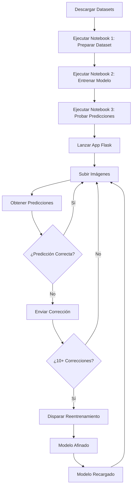

# Pipeline de Clasificación Multietiqueta de Alimentos

<p align="center">
  
</p>

<p align="center">
  <strong>Generador de Dataset Multietiqueta + Entrenamiento con MobileNetV2 + Seguimiento con MLflow + Interfaz Web Flask + Reentrenamiento Incremental</strong>
</p>

<p align="center">
  <b>Autores:</b> Erika Contreras, Alexander Chuquipoma<br>
  <b>Institución:</b> Universidad Politécnica Salesiana
</p>

---

## Resumen

Este repositorio implementa un **pipeline completo de extremo a extremo** para la clasificación multietiqueta de imágenes de alimentos con **capacidades de reentrenamiento incremental**:

| Paso | Descripción |
|------|-------------|
| 1 | Generar un **dataset multietiqueta real** a partir de Food11 + FoodOrNot |
| 2 | Entrenar un clasificador de deep learning usando **MobileNetV2 (ImageNet)** |
| 3 | Rastrear experimentos y métricas con **MLflow** |
| 4 | Ejecutar predicciones en imágenes (inferencia de imagen única) |
| 5 | Desplegar una **interfaz web Flask** para análisis visual |
| 6 | **Recopilar correcciones de usuarios** y reentrenar incrementalmente |

---

## Datasets Utilizados

| Dataset | Fuente | Propósito |
|---------|--------|-----------|
| **Food-11** | [Kaggle](https://www.kaggle.com/datasets/trolukovich/food11-image-dataset) | Categorías de alimentos (Lácteos, Arroz, Verduras) |
| **FoodOrNot** | [Kaggle](https://www.kaggle.com/datasets/sciencelabwork/food-or-not-dataset) | Muestras negativas de no alimentos |

---

## Clases Objetivo (Multietiqueta)

El modelo predice **probabilidades independientes** para cada clase:

| Clase | Descripción |
|-------|-------------|
| `lacteos` | Productos lácteos |
| `arroz` | Arroz |
| `frutas/verduras` | Frutas y verduras |

**Ejemplo de vectores multietiqueta:**

| Vector | Significado |
|--------|-------------|
| `[1, 0, 0]` | Solo lácteos |
| `[0, 1, 1]` | Arroz + Frutas/Verduras |
| `[1, 1, 1]` | Todas las clases |
| `[0, 0, 0]` | Ninguno / No es comida |

---

## Estructura del Repositorio

```
Food-Multi-Label-Classification-Pipeline/
│
├── raw/                                    # Datasets crudos (descarga manual)
│   ├── food11/
│   │   ├── training/
│   │   │   ├── Dairy product/
│   │   │   ├── Rice/
│   │   │   └── Vegetable-Fruit/
│   │   ├── validation/
│   │   └── evaluation/
│   └── foodornot/
│       ├── train/negative_non_food/
│       └── test/negative_non_food/
│
├── dataset/                                # Dataset generado (automático)
│   ├── images/
│   └── labels.csv
│
├── notebooks/                              # Jupyter Notebooks
│   ├── 1_prepare_dataset_multilabel_real.ipynb
│   ├── 2_train_multilabel (1).ipynb
│   └── predict_image_multilabel.ipynb
│
├── outputs/                                # Modelo entrenado
│   └── model.keras
│
├── corrections/                            # Sistema de reentrenamiento incremental
│   ├── pending.csv                         # Correcciones de usuario esperando reentrenamiento
│   ├── history/                            # Correcciones archivadas de reentrenamientos pasados
│   └── retraining_status.txt               # Estado actual del reentrenamiento
│
├── mlruns/                                 # Logs de experimentación MLflow (automático)
│
├── flask_app/                              # Aplicación Web
│   ├── app.py                              # API principal de Flask
│   ├── retrain_service.py                  # Servicio de reentrenamiento incremental
│   ├── templates/
│   │   └── index.html
│   └── static/
│       ├── style.css
│       └── uploads/
│
├── sync_labels.py                          # Sincronizar nuevas imágenes con labels.csv
└── test_model.py                           # Script rápido de prueba del modelo
```

---

## Requisitos

```bash
pip install tensorflow pandas numpy pillow scikit-learn mlflow flask
```

| Paquete | Propósito |
|---------|-----------|
| `tensorflow` | Framework de Deep Learning (MobileNetV2, tf.data) |
| `pandas` | Manejo de CSV y manipulación de datos |
| `numpy` | Operaciones numéricas |
| `pillow` | Carga de imágenes y generación de collages |
| `scikit-learn` | División entrenamiento/validación |
| `mlflow` | Seguimiento de experimentos |
| `flask` | Interfaz web para predicciones |

---

## Detalles del Pipeline

### Paso 1: Preparación del Dataset

**Notebook:** `notebooks/1_prepare_dataset_multilabel_real.ipynb`

Genera un dataset multietiqueta creando **imágenes de collage** que combinan múltiples categorías de alimentos.

**Configuración:**

| Parámetro | Valor | Descripción |
|-----------|-------|-------------|
| `N_TRAIN` | 3,000 | Collages para entrenamiento |
| `N_VAL` | 600 | Collages para validación |
| `N_TEST` | 600 | Collages para pruebas |
| `P_INCLUDE` | 0.60 | Probabilidad de que aparezca cada clase |
| `MAX_NONFOOD_TRAIN` | 1,200 | Muestras no alimentarias para entrenamiento |
| `IMG_SIZE` | 224×224 | Dimensiones de la imagen |

**Estadísticas de Salida:**

| Métrica | Valor |
|---------|-------|
| Total de imágenes | 5,800 |
| `lacteos` positivos | ~2,627 |
| `arroz` positivos | ~2,565 |
| `frutas/verduras` positivos | ~2,573 |
| No comida (NONE) | 1,600 |

---

### Paso 2: Entrenamiento del Modelo

**Notebook:** `notebooks/2_train_multilabel (1).ipynb`

Utiliza **transfer learning** con MobileNetV2 preentrenado en ImageNet.

**Arquitectura:**

```
Entrada (224×224×3)
       ↓
MobileNetV2 (Preentrenado en ImageNet)
       ↓
GlobalAveragePooling2D
       ↓
Dropout (0.2)
       ↓
Dense (3 unidades, sigmoid)
       ↓
Salida: [P(lacteos), P(arroz), P(frutas/verduras)]
```

**Estrategia de Entrenamiento en Dos Etapas:**

| Etapa | Descripción | Tasa de Aprendizaje | Parámetros Entrenables |
|-------|-------------|---------------------|------------------------|
| `head` | Entrenar solo el cabezal de clasificación (backbone congelado) | 1e-3 | ~3,843 |
| `finetune` | Descongelar las últimas 30 capas del backbone | 1e-4 | ~1M+ |

**Resultados del Entrenamiento:**

| Época | Precisión Ent. | Precisión Val. | AUC Val. | Pérdida Val. |
|-------|----------------|----------------|----------|--------------|
| 1 | 82.47% | 88.85% | 0.9606 | 0.2702 |
| 5 | 94.84% | 94.43% | 0.9877 | 0.1516 |
| 10 | 96.19% | 95.43% | 0.9915 | 0.1236 |

**Seguimiento con MLflow:**

```bash
mlflow ui
# Abrir http://localhost:5000
```

---

### Paso 3: Predicción de Imagen Única

**Notebook:** `notebooks/predict_image_multilabel.ipynb`

**Pipeline de Predicción:**

```python
# Cargar y preprocesar
img = tf.io.read_file(path)
img = tf.image.decode_image(img, channels=3)
img = tf.image.resize(img, (224, 224))
img = img / 255.0

# Predecir
probs = model.predict(img)

# Aplicar umbrales
THRESH = 0.50
NONE_IF_MAX_BELOW = 0.45
```

**Lógica de Decisión:**

| Condición | Resultado |
|-----------|-----------|
| Cualquier clase ≥ 0.50 | Devolver todas las clases sobre el umbral |
| Probabilidad máx < 0.45 | "No encontrado / Ninguno" |
| De lo contrario | "Incierto (más probable: X)" |

**Ejemplo de Salida:**

```
📌 Imagen: test_0000001.jpg

Probabilidades:
 - lacteos: 92.94%
 - arroz: 2.33%
 - frutas/verduras: 99.95%

✅ Resultado Final: lacteos, frutas/verduras
```

---

### Paso 4: Aplicación Web Flask

**Ubicación:** `flask_app/`

```bash
cd flask_app
python app.py
# Abrir http://localhost:5000
```

**Características:**

- **Carga de múltiples imágenes** vía formulario web (JPG, PNG, WEBP)
- **Predicciones en tiempo real** con visualización de probabilidades
- **Internacionalización** (Inglés/Español)
- **Envío de correcciones** para mejora del modelo
- **Reentrenamiento automático** cuando se acumulan suficientes correcciones

**Endpoints de la API:**

| Endpoint | Método | Descripción |
|----------|--------|-------------|
| `/` | GET/POST | Página principal con carga de imágenes y predicción |
| `/correct_labels` | POST | Enviar corrección para una predicción |
| `/trigger_retrain` | POST | Disparar reentrenamiento manualmente |
| `/retrain_status` | GET | Consultar estado del reentrenamiento |

---

### Paso 5: Sistema de Reentrenamiento Incremental

**Servicio:** `flask_app/retrain_service.py`

El sistema implementa un **bucle de retroalimentación** donde las correcciones del usuario mejoran automáticamente el modelo.

**Cómo Funciona:**

1. **Usuario corrige** una predicción incorrecta vía interfaz web
2. La corrección se guarda en `corrections/pending.csv`
3. Cuando se acumulan **10+ correcciones**, se dispara el reentrenamiento
4. El modelo se **afina (fine-tuning)** en:
   - Muestra del dataset original (200 imágenes)
   - Correcciones del usuario (repetidas 25x para énfasis)
5. El modelo actualizado reemplaza al antiguo
6. Las correcciones se archivan en `corrections/history/`

**Configuración:**

| Parámetro | Valor | Descripción |
|-----------|-------|-------------|
| `MIN_CORRECTIONS` | 10 | Correcciones mínimas para disparar reentrenamiento |
| `SAMPLE_ORIGINAL` | 200 | Imágenes muestreadas del dataset original |
| `BOOST_FACTOR` | 25 | Factor de repetición para correcciones |
| `EPOCHS` | 3 | Épocas de ajuste fino |
| `LEARNING_RATE` | 1e-5 | LR muy bajo para evitar olvido catastrófico |
| `UNFREEZE_LAYERS` | 15 | Número de capas del backbone a descongelar |

**Estrategia de Reentrenamiento:**

- **Ajuste fino conservador**: Solo descongela las últimas 15 capas (vs 30 en entrenamiento inicial)
- **Baja tasa de aprendizaje**: 1e-5 para preservar características aprendidas
- **Dataset equilibrado**: Combina muestras originales con correcciones potenciadas
- **No bloqueante**: Se ejecuta en un hilo en segundo plano

**Rastreo de Estado:**

```bash
# Consultar estado de reentrenamiento
cat corrections/retraining_status.txt

# Ejemplo de salida:
STATUS:idle
Waiting for corrections... (7/10)
```

---

## Scripts de Soporte

### sync_labels.py

Sincroniza nuevas imágenes en `dataset/images/` con `dataset/labels.csv`.

**Uso:**

```bash
# Generar pending.csv con imágenes sin etiquetar
python sync_labels.py

# Añadir directamente a labels.csv (con 0s)
python sync_labels.py --merge

# Rutas personalizadas
python sync_labels.py --labels_csv dataset/labels.csv \
                      --images_dir dataset/images \
                      --pending_csv dataset/labels_pending.csv
```

**Flujo de Trabajo:**

1. Escanea `dataset/images/` en busca de archivos de imagen
2. Compara con entradas existentes en `labels.csv`
3. Genera `labels_pending.csv` con imágenes faltantes
4. El usuario edita manualmente el archivo pendiente para añadir etiquetas correctas
5. Opcionalmente fusiona en `labels.csv` con la bandera `--merge`

---

### test_model.py

Script rápido para probar el modelo en una imagen única.

**Uso:**

```python
# Editar ruta de imagen en el script
img_path = r"C:\path\to\image.png"

# Ejecutar
python test_model.py
```

**Ejemplo de Salida:**

```
Pred: {'lacteos': 0.9294, 'arroz': 0.0233, 'frutas/verduras': 0.9995}
Max: frutas/verduras => 0.9995
✅ FINAL: ['lacteos', 'frutas/verduras']
```

---

## Guía de Inicio Rápido

```bash
# 1. Clonar el repositorio
git clone <repo-url>
cd Food-Multi-Label-Classification-Pipeline

# 2. Instalar dependencias
pip install tensorflow pandas numpy pillow scikit-learn mlflow flask

# 3. Descargar datasets de Kaggle
# - Food-11: https://www.kaggle.com/datasets/trolukovich/food11-image-dataset
# - FoodOrNot: https://www.kaggle.com/datasets/sciencelabwork/food-or-not-dataset
# Colocar en directorio raw/

# 4. Ejecutar notebooks en orden:
jupyter notebook notebooks/1_prepare_dataset_multilabel_real.ipynb
jupyter notebook notebooks/2_train_multilabel\ \(1\).ipynb
jupyter notebook notebooks/predict_image_multilabel.ipynb

# 5. (Opcional) Ver experimentos MLflow
mlflow ui
# Abrir http://localhost:5000

# 6. Lanzar aplicación web
cd flask_app
python app.py
# Abrir http://localhost:5000

# 7. Usar la interfaz web para:
#    - Subir imágenes para predicción
#    - Enviar correcciones cuando las predicciones sean erróneas
#    - Disparar reentrenamiento cuando se acumulen 10+ correcciones
```

---

## Flujo de Trabajo Completo: De Entrenamiento a Reentrenamiento



---

## Decisiones Técnicas Clave

| Decisión | Justificación |
|----------|---------------|
| **MobileNetV2** | Ligero, eficiente, adecuado para despliegue móvil/edge |
| **Activación Sigmoid** | Probabilidad independiente por clase (multietiqueta) |
| **Binary Cross-Entropy** | Pérdida estándar para clasificación multietiqueta |
| **Generación de Collages** | Simula escenarios del mundo real con múltiples alimentos |
| **Negativos No Comida** | Reduce falsos positivos, mejora capacidad de rechazo |
| **Ponderación de muestras (NEG_WEIGHT=4.0)** | Penaliza falsos positivos en muestras NONE |
| **Entrenamiento en dos etapas** | Primero solo cabezal, luego ajuste fino para mejor convergencia |
| **Reentrenamiento conservador** | Descongela menos capas (15 vs 30) para evitar olvido |
| **Potenciación de correcciones** | Repite correcciones 25x para enfatizar feedback de usuario |
| **Reentrenamiento con LR bajo** | 1e-5 vs 1e-4 para preservar características aprendidas |

---

## Aplicaciones en el Mundo Real

Este pipeline puede adaptarse para varios casos de uso prácticos:

| Aplicación | Descripción |
|------------|-------------|
| **Apps de Nutrición** | Identificar tipos de alimentos automáticamente en fotos de comidas para seguimiento dietético |
| **Refrigeradores Inteligentes** | Detectar e inventariar alimentos dentro de refrigeradores |
| **Automatización de Restaurantes** | Verificar platos antes de servir para asegurar componentes correctos |
| **Cuidado de la Salud** | Monitorear comidas de pacientes para cumplimiento dietético |
| **QA de Entrega de Comida** | Validar contenido de pedidos mediante análisis de imagen |

---

## Valor Educativo

Este proyecto demuestra conceptos clave en deep learning moderno:

| Concepto | Implementación |
|----------|----------------|
| **Transfer Learning** | Uso de MobileNetV2 preentrenado como extractor de características |
| **Clasificación Multietiqueta** | Salidas Sigmoid con pérdida binary cross-entropy |
| **Aumento de Datos** | Generación de collages para simular escenarios complejos |
| **Muestreo Negativo** | Incluir imágenes de no comida para reducir falsos positivos |
| **Seguimiento de Experimentos** | MLflow para experimentos ML reproducibles |
| **Despliegue de Modelos** | Aplicación web Flask para inferencia |
| **Entrenamiento en Dos Etapas** | Estrategia de entrenamiento de cabezal + ajuste fino |
| **Aprendizaje Incremental** | Bucle de retroalimentación de usuario con reentrenamiento conservador |
| **Aprendizaje Activo** | Recolección de correcciones en ejemplos difíciles |

---

## Logros Técnicos

| Métrica | Valor |
|---------|-------|
| **Precisión Validación** | 95.43% |
| **AUC Validación** | 0.9915 |
| **Tamaño Modelo** | ~8.6 MB (MobileNetV2) |
| **Tiempo Inferencia** | < 100ms (CPU) |
| **Listo para Inferencia** | Sí (Formato Keras .keras) |
| **Despliegue Web** | Aplicación Flask incluida |
| **Aprendizaje Incremental** | Sistema de reentrenamiento automatizado |

---

## Por Qué Importa Multietiqueta

A diferencia de la clasificación multiclase tradicional (una etiqueta por imagen), la **clasificación multietiqueta** es esencial para escenarios del mundo real donde:

- Una sola imagen puede contener **múltiples alimentos**
- El modelo debe reconocer **combinaciones** (ej. lácteos + arroz en la misma comida)
- El modelo debe **rechazar** correctamente imágenes que no contienen clases relevantes

Este enfoque refleja la percepción humana: raramente vemos ingredientes aislados; en cambio, vemos platos completos con múltiples componentes.

---

## Mejoras Futuras

- **Expandir clases**: Añadir más categorías de alimentos
- **Detección de objetos**: Integrar YOLO para localización
- **Optimización del modelo**: Cuantización para despliegue móvil
- **Backend de base de datos**: Reemplazar CSV con base de datos adecuada
- **Sistema de colas**: Usar Celery para reentrenamiento asíncrono
- **Pruebas A/B**: Comparar versiones del modelo en producción
- **Visualización Grad-CAM**: Mostrar en qué se fija el modelo

---

## Licencia

Este proyecto se desarrolla como parte de investigación académica en la Universidad Politécnica Salesiana.

---

## Autores

- **Erika Contreras**
- **Alexander Chuquipoma**

**Institución:** Universidad Politécnica Salesiana
